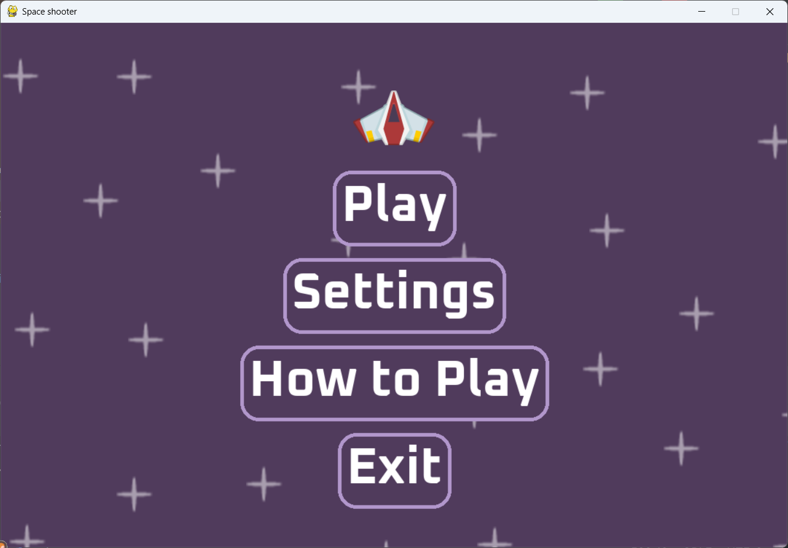
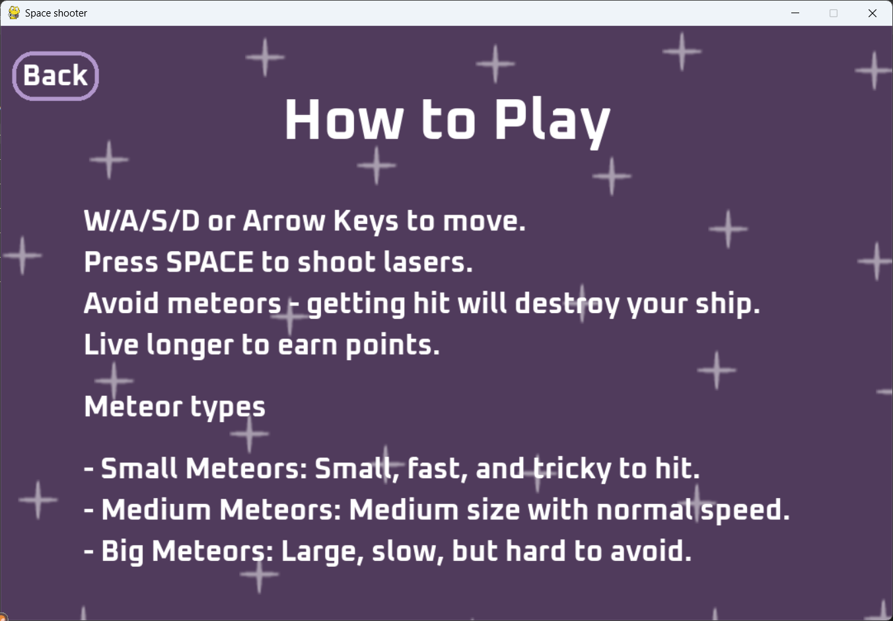
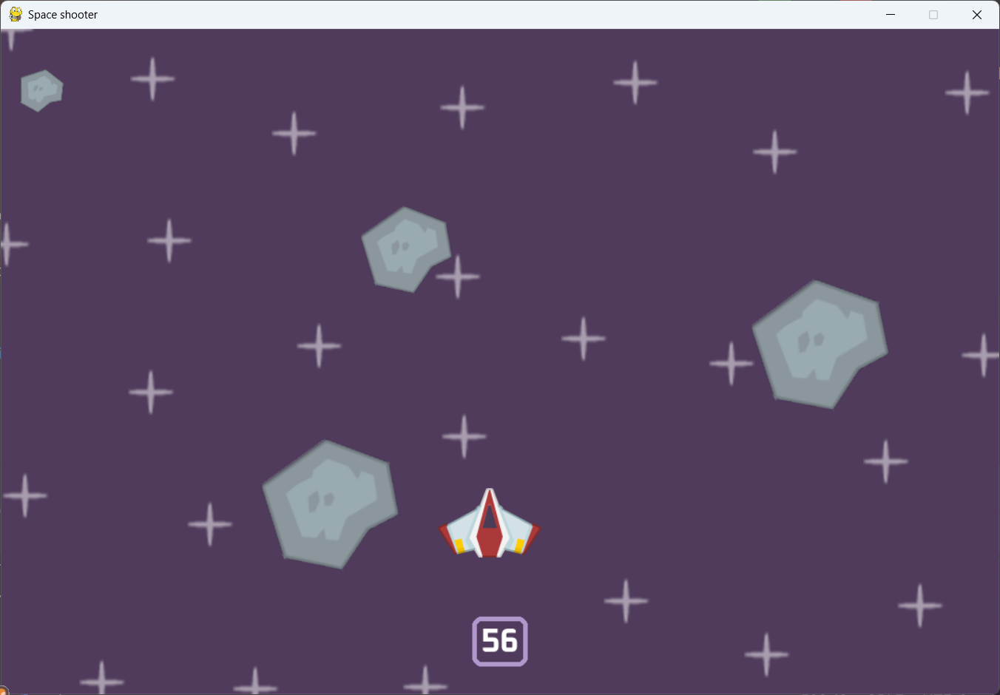
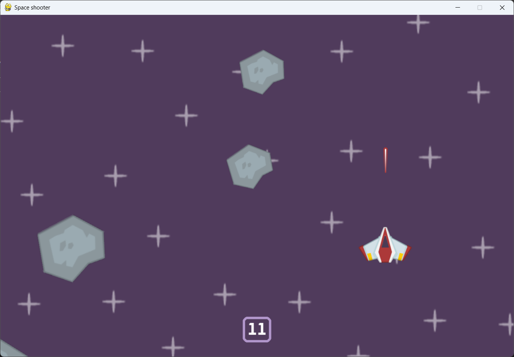
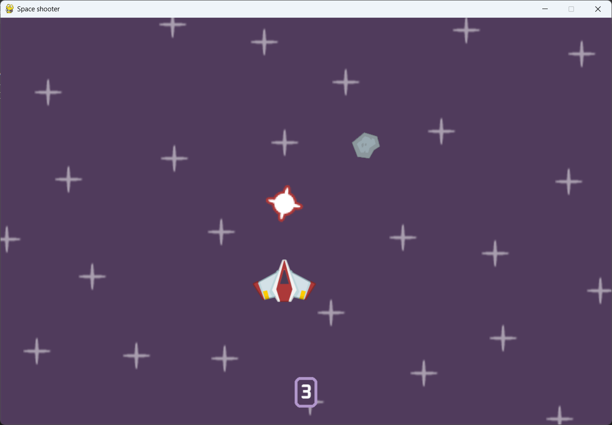
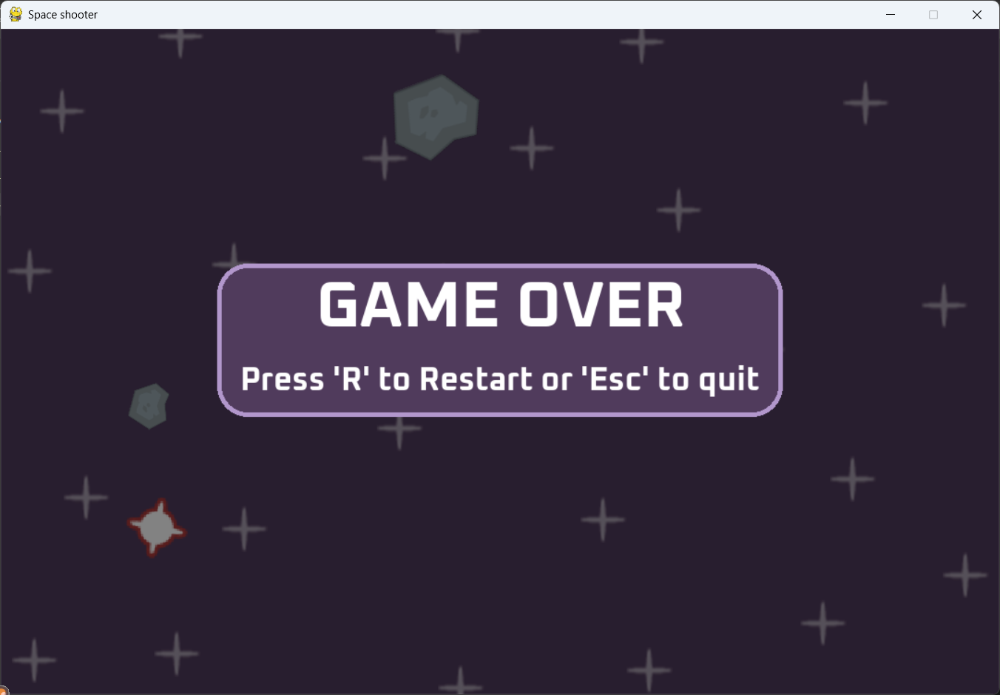
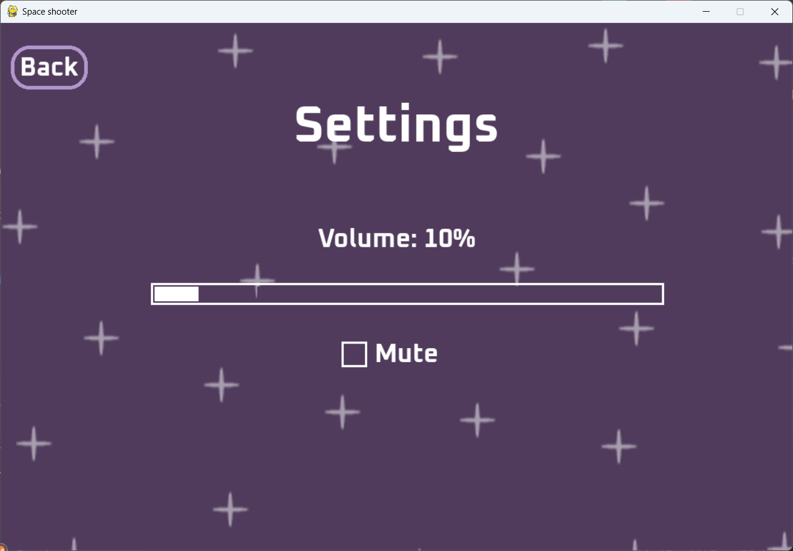
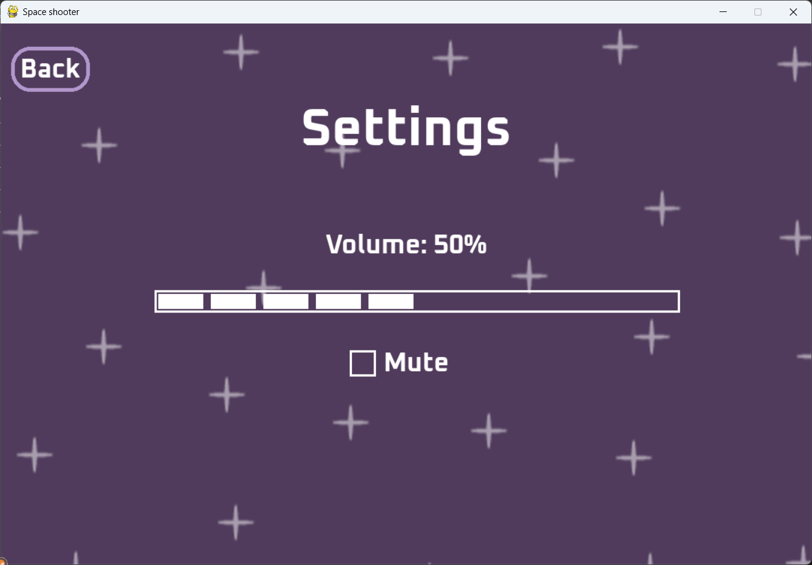
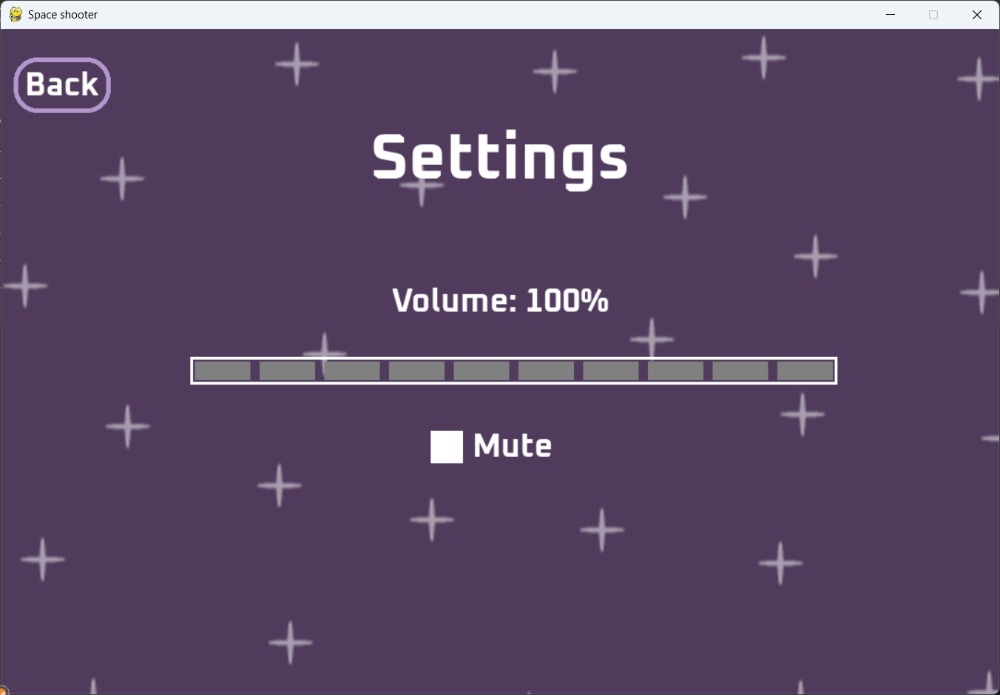

<h1 align="center">🚀 Space Shooter Game</h1>
<p align="center">
  <em>A fast-paced 2D arcade shooter built with Python & Pygame</em>
</p>

---

## 🎮 About the Game
A fully functional **2D Space Shooter game** developed using **Python** and **Pygame**, as part of my [UNEC] coursework (Nov–Dec 2024). The game features smooth player movement, dynamic difficulty scaling, interactive menus, and frame rate-independent performance to demonstrate core concepts such as event handling, collision detection, and performance optimization in game development. It was a great opportunity to learn about **delta time movement** and **pixel-perfect collisions**.

---

## ✨ Features

| Category | Highlights |
|----------|------------|
| 👾 **Gameplay** | Smooth directional movement using normalized vectors, laser shooting with cooldown, meteor spawn scaling, procedural stars |
| 🧠 **Advanced Logic** | Pixel-perfect mask collisions, delta time movement, size-based explosion animations |
| 📊 **Performance** | Sprite groups for efficient rendering, 60 FPS stability across systems |
| 🖱️ **UI/UX** | Main menu (Play, Settings (volume control/mute), How to Play, Exit), game over with restart |

---

🕹️ How to Play
The objective is to survive for as long as possible by shooting and destroying incoming meteors. Points are awarded for each meteor destroyed. The game ends if your ship is hit. The difficulty increases as you play, with more meteors spawning over time.

---

## 📷 Screenshots

<p float="display: flex; overflow-x: auto;">
  
  
   
  
  
  
  
  
  
</p>

---

## 🗺️ Controls

| Action                | Key(s)                |
|-----------------------|-----------------------|
| Move                  | W/A/S/D or Arrow Keys |
| Shoot Laser           | Spacebar              |
| Restart (after death) | R                     |
| Quit Game             | Esc or Exit button    |

---

## 📂 Project Structure
```
├── README.md
├── LICENSE.txt
├── .gitignore
├── requirements.txt
├── images/            # Game sprites, stars, explosion frames, fonts
├── audio/             # Sound effects and background music
└── main.py
```

---

## 🛠️ Technologies Used

- [Python 3.x](https://www.python.org/)
- [Pygame](https://www.pygame.org/)
- Pixel-perfect collision (`pygame.mask`)
- Delta time and event-driven spawning

## ✅ To Run the Game

1. **Clone the repo:**
   ```bash
   git clone https://github.com/orkhan-muradov-dev/space-shooter-pygame.git
   cd space-shooter-pygame
   ```

2. **Install dependencies:**
   ```bash
   pip install -r requirements.txt
   ```

3. **Run the game:**
   ```bash
   python main.py
   ```
