<h1 align="center">🚀 Space Shooter Game</h1>
<div align="center">
   <em>A fast-paced 2D arcade shooter built with Python & Pygame</em>

   

   [🎮 Play](#-quick-start) • [🎯 Features](#-key-features) • [📸 Gallery](#-gallery) • [🏗️ Architecture](#️-architecture) • [💻 Development](#-development)
</div>

---

## ⚡ Quick Start
```bash
# Clone the repository
git clone https://github.com/orkhan-muradov-dev/space-shooter-pygame.git
cd space-shooter-pygame

# Install dependencies
pip install -r requirements.txt

# Launch the game
python -m src.main

# Optional: verify pygame
python -c "import pygame; print(f'✅ Pygame {pygame.version.ver} ready!')"
```
**System Requirements:** Python 3.6+ | Pygame 2.1.3+ | 100MB free space

---

## 🎯 Game Overview

**Mission:** Survive the cosmic meteor shower as long as possible!

- **🎪 Dynamic Difficulty** - Meteor intensity scales with survival time
- **🏆 High Score System** - Persistent leaderboard with local file storage
- **🎵 Immersive Audio** - Context-aware music and sound effects
- **⚡ Optimized Performance** - Maintains 120+ FPS during intense gameplay
- **🎮 Intuitive Controls** - Responsive keyboard input with multiple control schemes

---

## 🗺️ Controls

| **Action**            | **Keys**               | **Description**               |
|-----------------------|------------------------|-------------------------------|
| Move                  | `W A S D` or `↑ ← ↓ →` | Navigate your spacecraft      |
| Shoot                 | `SPACE`                | Shoot lasers at meteors       |
| Mute                  | `M`                    | Toggle sound on/off           |
| Pause                 | `P`                    | Pause/resume game             |
| Restart               | `R`                    | Quick restart after game over |
| Quit                  | `Esc`                  | Return to menu/quit game      |

---

## ✨ Key Features

### 🎮 Core Gameplay
- **Precision Movement** - Smooth directional control using **normalized vectors** for responsive ship handling
- **Smart Collision System** - **Pixel-perfect detection** ensuring accurate hit registration and fair gameplay
- **Progressive Challenge** - Dynamic meteor spawn rate that scales with survival time, keeping you on edge
- **Weapon System** - Laser shooting with **cooldown** mechanics to balance gameplay

### 🎨 Audio & Visual Excellence
- **Multi-Context Audio** - **Unique soundtracks** that adapt to game state (menu, gameplay, pause, game over)
- **Particle Effects** - Stunning **explosion animations** and **celebratory confetti** for achievement moments
- **Dynamic Background** - **Procedurally generated** star field
- **Polished UI** - Modern interface design with smooth transitions and intuitive navigation

### 💾 Data & Performance
- **Persistent Storage** - Robust high-score system with **local file management**
- **Performance Optimized** - Advanced **sprite pooling** and **efficient rendering** maintaining 120+ FPS
- **Modular Architecture** - Clean, extensible code structure following **SOLID principles** for maintainability
- **Error Handling** - Comprehensive **exception management** ensuring stable gameplay experience

---

## 📸 Gallery

<details> <summary>🖼️ <strong>View Screenshots</strong> (Click to expand)</summary>

| **Main Menu**                                      | **Gameplay**                        | **Game States**                             |
|----------------------------------------------------|-------------------------------------|---------------------------------------------|
| 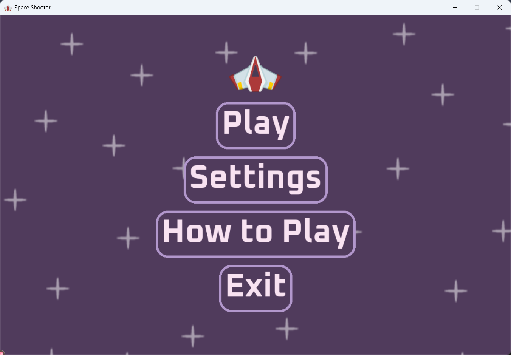                 | 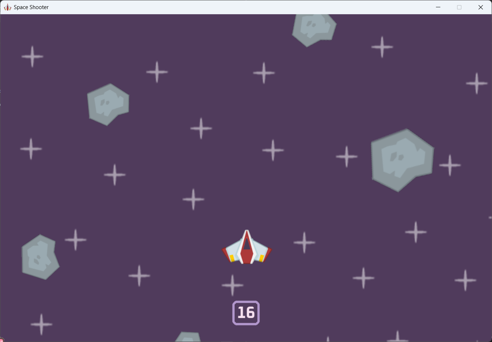           | 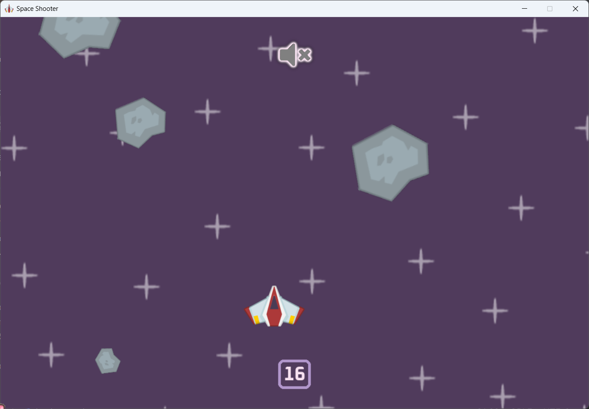        |
| 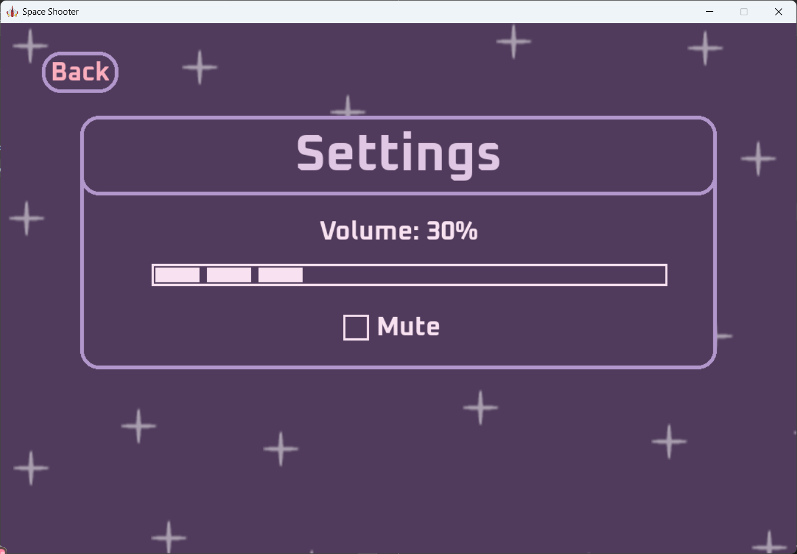           | 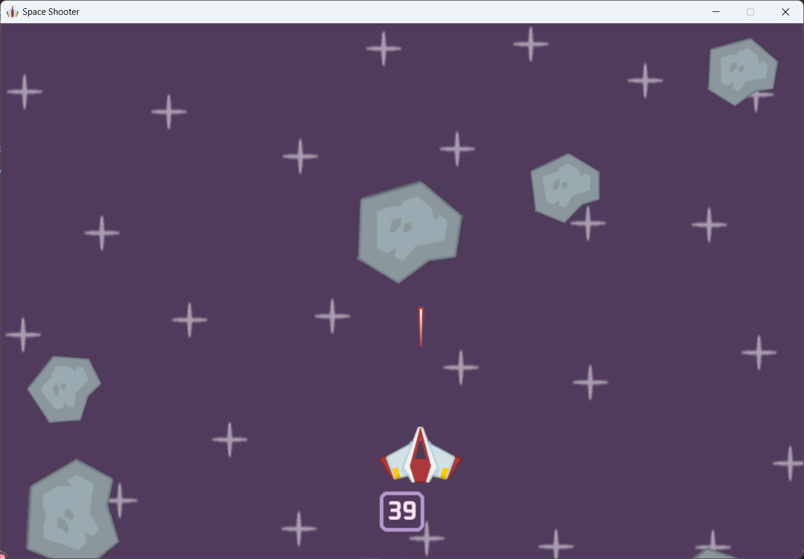   | 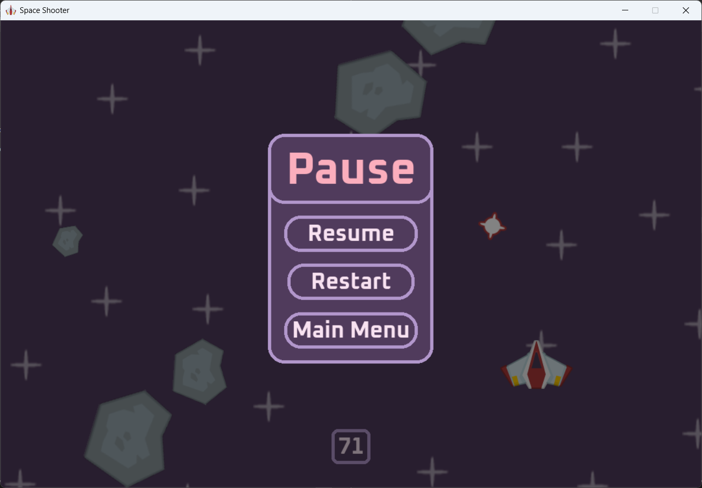                 |
| 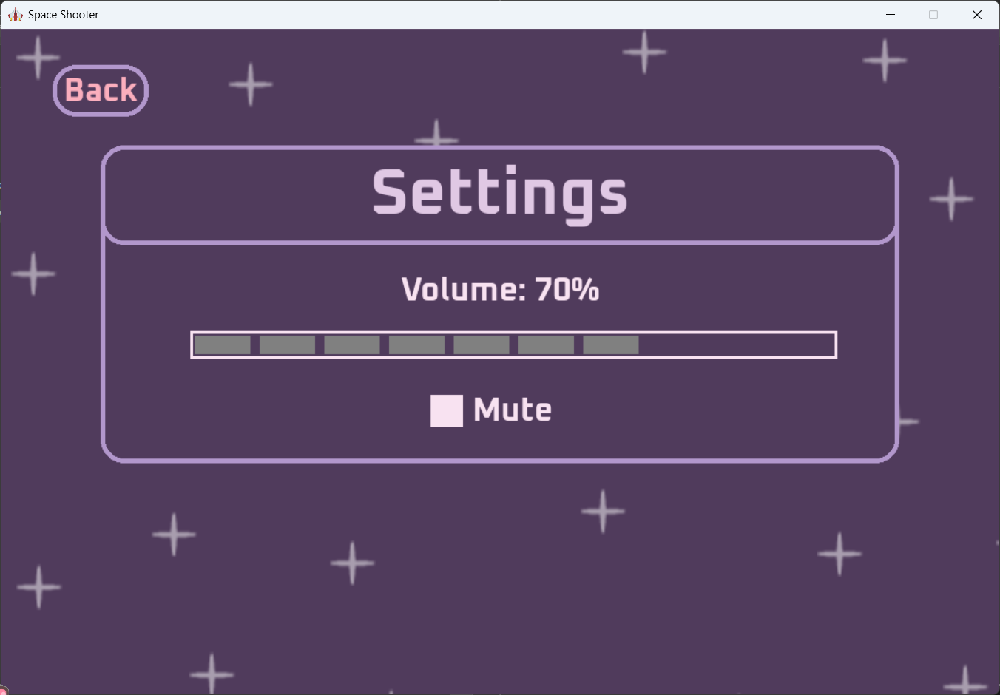 | 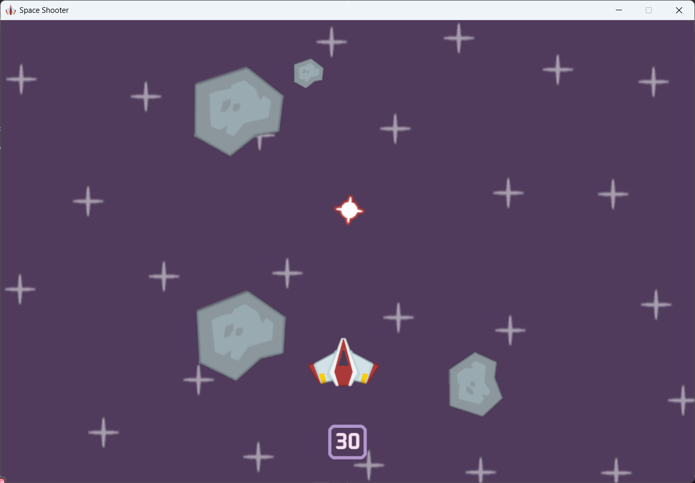 | 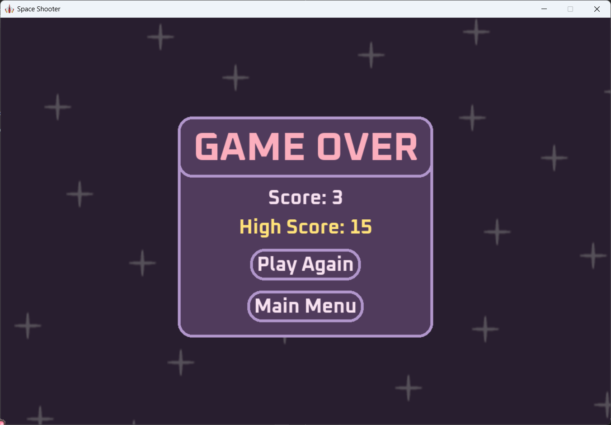          |
| 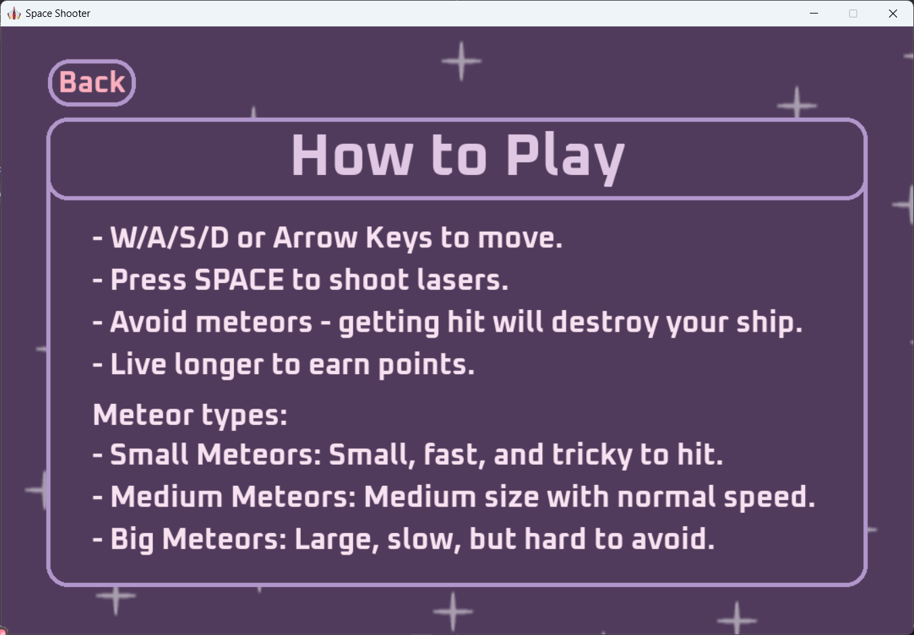              |                                     | 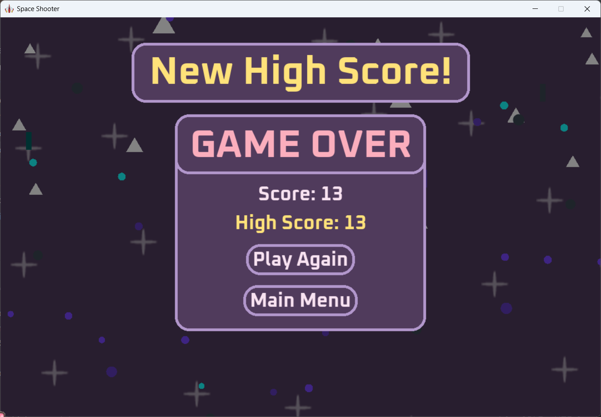 |

</details>

---

## 🏗️ Architecture

```
space-shooter-pygame/
├── 📁 src/
│   ├── main.py                 # 🚪 Entry point & initialization
│   ├── game.py                 # ⚙️ Core game loop & state management
│   ├── settings.py             # 📋 Configuration constants
│   ├── assets.py               # 🎨 Singleton resource loader
│   ├── sounds.py               # 🔊 Audio management system
│   ├── high_score.py           # 💾 Persistent score storage
│   ├── events.py               # 📡 Custom event definitions
│   │
│   ├── 📁 sprites/             # 🎯 Game entities
│   │   ├── player.py           # 🚀 Player ship & controls
│   │   ├── laser.py            # ⚡ Projectile system
│   │   ├── meteor.py           # ☄️ Enemy spawn & behavior
│   │   ├── star.py             # ⭐ Background effects
│   │   ├── explosion.py        # 💥 Particle effects
│   │   └── confetti.py         # 🎉 Celebration animations
│   │
│   └── 📁 ui/                  # 🖼️ User interface
│       ├── menus.py            # 📋 Menu state management
│       ├── button.py           # 🔘 Interactive elements
│       ├── frame.py            # 📦 UI containers
│       └── background.py       # 🌌 Dynamic backgrounds
│
├── 📁 audio/                   # 🎵 Sound effects & music
└── 📁 images/                  # 🖼️ Sprites & textures
```

---

## 💻 Development

### ⚙️ Key Technical Implementations:
- **Design Patterns:** Singleton (Assets), Component (UI), Observer (Events)
- **Performance:** Sprite pooling, delta-time movement, dirty rect rendering
- **Architecture:** SOLID principles with clean module separation
- **Modern Python:** Type hints, pathlib, exception handling

### 📊 Performance Metrics:
| **Metric**        | **Value**  | **Notes**                            |
|-------------------|------------|--------------------------------------|
| **Frame Rate**    | 120+ FPS   | With a bunch of simultaneous sprites |
| **Memory Usage**  | <150MB     | During active gameplay               |
| **Time**          | <2 seconds | Load from launch to main menu        |
| **Input Latency** | <16ms      | Keyboard response time               |

### 🛠️ Tech Stack

| **Category**    | **Technologies**                        |
|-----------------|-----------------------------------------|
| Language        | [Python 3.6+](https://www.python.org/)  |
| Framework       | [Pygame 2.1.3+](https://www.pygame.org) | 
| Version Control | Git with conventional commits           | 
| Development     | VS Code, PyCharm compatible             |

---

## 🛣️ Roadmap

### ✅ Current Version
- Core gameplay mechanics with progressive difficulty
- Complete audio system with contextual music
- Polished UI/UX with smooth transitions
- Performance optimization for smooth gameplay
- Persistent high-score tracking

### 🎯 Upcoming Features
- **🖥️ Resizable Window** - Dynamic resolution and fullscreen support
- **🎮 Gamepad Support** - Xbox/PlayStation controller compatibility
- **📦 Executable Build** - Standalone distribution via PyInstaller
- **⚡ Power-ups System** - Special abilities and temporary bonuses
- **🌐 Online Features** - Cloud leaderboards and achievement system

---

## 🤝 Contributing
Contributions are welcome! Whether you're fixing bugs, adding features, or improving documentation, your help is appreciated.
```bash
# 1. Fork & clone your fork
git clone https://github.com/orkhan-muradov-dev/space-shooter-pygame.git

# 2. Create feature branch
git checkout -b feature/amazing-feature

# 3. Make changes, test, and commit
git commit -m "feat: add amazing feature"

# 4. Push and create PR
git push origin feature/amazing-feature
```

---

## 📝 License
This project is licensed under the MIT License - see the [LICENSE.txt](./LICENSE.txt) file for details.

---

<h2 align="center">
⭐ If you enjoyed this project, please consider giving it a star!
Built with ❤️ and Python
</h2>
